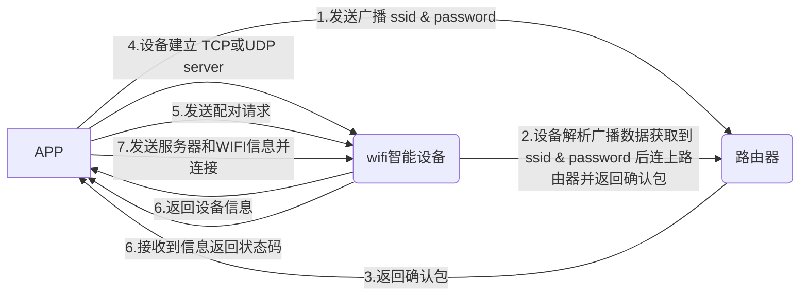
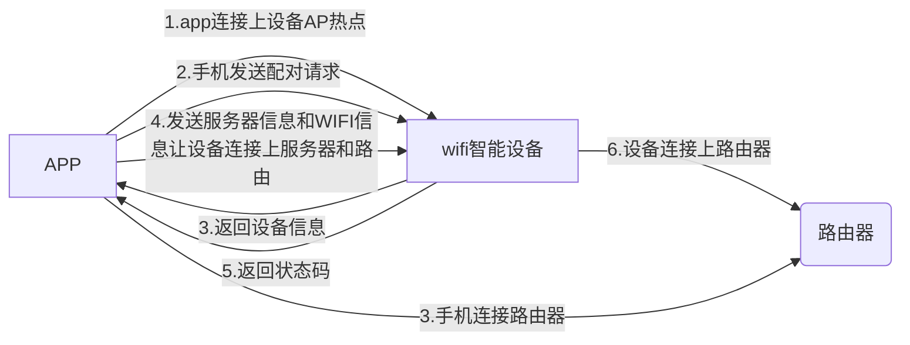

# EsptouchDemo
### 文章包含内容
 1. 什么是配网？ 
 2. 常见的配网方案； 
 3. 常见WiFi快连技术厂商； 
 4. 实际开发中问题；
 5. GitHub 项目地址； 
 6. CSDN 项目地址；
<hr/>
纵然WIFI设备配网目前虽然已经非常成熟，市面上也有了很多的配网框架，但是在实际的开发过程中还是遇到一些小坎坷，在这里做个记录，以见证自己的成长。

### 一、什么是配网
当设备要与用户进行交互时，首先得让设备连接上网络（连上路由器），那么这个设备联网的过程我们称之为配网。当然这里我们主要介绍WIFI设备的配网过程，如蓝牙、Zigbee、NB-Iot等协议的智能设备，在需要实现远程控制时一般都是与WIFI模块配合使用（原因不多解释）。
<hr />

### 二、常见的配网方案
**2.1 快速配对过程**

==具体流程：==

 1. 设备进入配置模式：
 2. touch模式 设备等待APP广播 SSID & password
 3. 设备获取到 SSID & password 后连上路由器，返回 touch UDP 确认包
 4. 设备建立 TCP或UDP server（http server）
 5. 手机发送：（请求配对）
 6. 设备回应：（设备信息）
 7. 手机回应：（服务器信息和WIFI信息等）
 8. 设备回应是否接收成功

到这里就可以对设备进行控制了，做个j简单的思路介绍，具体的app和设备之间的通讯协议规范，就由厂商或您自己来规定了。

**2.2 AP配对过程**

==具体流程：==
 1. 设备进入配置模式：AP 热点，TCP 或UDP server（http server）
 2. 手机连到 AP热点
 3. 手机发送：（请求配对）
 4. 设备回应：（设备信息）
 5. 手机回应：（服务器信息和WIFI信息等）
 6. 设备回应是否接收成功

想要了解详细配对过程，建议了解WiFi的四种工作模式，包含Staion、SoftAP、Sniffer、Promisc，在配对过程中WIFI模式的转换，快连模式中udp数据的加密，手机和设备建立通讯后之间的详细交互等。

**2.3 重点参见**

下面是大神们对快连模式的技术讲解，原封不动的贴上了：
参见：[IOT小能手](https://blog.csdn.net/sadshen/article/details/47049129)

**实现原理是这样：手机通过UDP广播，将AP的相关信息组帧发出。而WiFi模块一直处于UDP监听状态。获取到AP信息之后，WiFi模块便可以接入AP了。**

**这里有一个难点是，如果WLAN都是不加密的话，那UDP直接把相关信息发出来就好，但可惜路由器AP的加密方式是不固定的，模块没法知道UDP数据是何种加密方式，因此没办法解析出DATA信息。**

如下是802.2的封装格式。
 
所以，DATA不行，聪明的人类打算从其他字段下手，大部分字段手机端无法获得权限，最适合的只剩下长度字段。


这里举个例子，比如要发送“1，2，3”，即[0x31, 0x32, 0x33]。那么应该发送如下数据：


<hr/>

### 三、常见WiFi快连技术厂商
怎么说、、、？嗯.网上大家都是这么说的，快连技术其实原理上都是类似，但各家都分别给这项技术取了名字，不同的厂商还专门申请了不同的专利而已。在他们这些技术大佬眼中，TI才是最牛逼的厂商，他们是最早将这项技术进行攻克，并将其称之为SmartConfig，这也是目前最多的叫法。

厂商| 技术名称
-------- | -----
TI  | SmartConfig
MTK  | SmartConnection
Marwell  | EasyConnect
Reltek | SmipleConfig
乐鑫 | Smartconfig
微信 | Airkiss
阿里云 | [C-SDK](https://help.aliyun.com/document_detail/97570.html)
涂鸦 | [tuya-SDK](https://docs.tuya.com/cn/mcu/tuya-wifi-reset.html)
酷宅 | [coolkit-SDK](https://www.showdoc.cc/coolkit?page_id=1298046202417998)

### 四、实际开发中问题
**4.1 初识配网Demo**

本demo仅介绍快连模式中如何广播wifi帐号密码以及接收设备返回的确认包（如设备连接路由的ip），至于手机和设备之间的通讯（常用TCP/UDP）获取设备id等信息就因不同的厂商而有所不同了，Demo架构如下图：


不要问我什么年代了还贴eclipse项目，我只能说这种感觉就像谈女朋友一样，也许你明知道她有很多缺点，但每当提出分手却都在挽留。[Android Demo](https://github.com/Life1412378121/EsptouchDemo)传送门内涵半颗心脏的（[Esp8266驱动ws2812源码限于gpio0](https://download.csdn.net/download/qq_35350654/11074543)），需要什么工具自己进去选吧，这次我随大流。

**4.2 Android6.0以上不能连上指定Wifi问题**

参见：[Good包籽](https://github.com/Goodbao/WifiDemo)

大概的意识是Andorid6.0以上版本，由于权限问题，不能连上指定Wifi，所以大神们做了一点兼容的小改变，总结大致如下：

```
	<!-- wifi控制和状态权限 -->
    <uses-permission android:name="android.permission.CHANGE_WIFI_STATE" />
    <uses-permission android:name="android.permission.ACCESS_WIFI_STATE" />
    <!-- 网络状态改变的权限 -->
    <uses-permission android:name="android.permission.ACCESS_NETWORK_STATE" />
    <uses-permission android:name="android.permission.CHANGE_NETWORK_STATE" />
    <!-- 6.0以上打开蓝牙和wifi最好加上定位权限，获取wifi列表要用 -->
    <uses-permission android:name="android.permission.ACCESS_FINE_LOCATION" />
    <!-- 获取网络权限 -->
    <uses-permission android:name="android.permission.INTERNET"/
```

```
/**
 * 连接指定wifi
 * 6.0以上版本，直接查找时候有连接过，连接过的拿出wifiConfiguration用
 * 不要去创建新的wifiConfiguration,否者失败
 */
public void addNetWork(String SSID, String password, int Type)
{
    int netId = -1;
    /*先执行删除wifi操作，1.如果删除的成功说明这个wifi配置是由本APP配置出来的；
                       2.这样可以避免密码错误之后，同名字的wifi配置存在，无法连接；
                       3.wifi直接连接成功过，不删除也能用, netId = getExitsWifiConfig(SSID).networkId;*/
    if (removeWifi(SSID))
    {
        //移除成功，就新建一个
        netId = mWifiManager.addNetwork(createWifiInfo(SSID, password, Type));
    } else
    {
        //删除不成功，要么这个wifi配置以前就存在过，要么是还没连接过的
        if (getExitsWifiConfig(SSID) != null)
        {
            //这个wifi是连接过的，如果这个wifi在连接之后改了密码，那就只能手动去删除了
            netId = getExitsWifiConfig(SSID).networkId;
        } else
        {
            //没连接过的，新建一个wifi配置
            netId = mWifiManager.addNetwork(createWifiInfo(SSID, password, Type));
        }
    }
 
    //这个方法的第一个参数是需要连接wifi网络的networkId，第二个参数是指连接当前wifi网络是否需要断开其他网络
    //无论是否连接上，都返回true。。。。
    mWifiManager.enableNetwork(netId, true);
}
 
/**
 * 获取配置过的wifiConfiguration
 */
public WifiConfiguration getExitsWifiConfig(String SSID)
{
    wifiConfigurationList = mWifiManager.getConfiguredNetworks();
    for (WifiConfiguration wifiConfiguration : wifiConfigurationList)
    {
        if (wifiConfiguration.SSID.equals("\"" + SSID + "\""))
        {
            return wifiConfiguration;
        }
    }
    return null;
}
 
/**
 * 移除wifi，因为权限，无法移除的时候，需要手动去翻wifi列表删除
 * 注意：！！！只能移除自己应用创建的wifi。
 * 删除掉app，再安装的，都不算自己应用，具体看removeNetwork源码
 *
 * @param netId wifi的id
 */
public boolean removeWifi(int netId)
{
    return mWifiManager.removeNetwork(netId);
}
 
/**
 * 移除wifi
 *
 * @param SSID wifi名
 */
public boolean removeWifi(String SSID)
{
    if (getExitsWifiConfig(SSID) != null)
    {
        return removeWifi(getExitsWifiConfig(SSID).networkId);
    } else
    {
        return false;
    }
}
```

**4.3 Android8.0以上系统无法获取ssid问题**

当然我是后来者，无需重新造轮子，但是在整合大神们的代码时发现，在Android8.0后，无法获取wifi的ssid（wifi名称），我的解决如下：

```
public class EspWifiAdminSimple {

	private final Context mContext;

	public EspWifiAdminSimple(Context context) {
		mContext = context;
	}

	/**
	 * 获取ssid
	 * 
	 * @return
	 */
	public String getWifiConnectedSsid() {
		WifiInfo mWifiInfo = getConnectionInfo();
		String ssid = null;
		if (mWifiInfo != null && isWifiConnected()) {
			int len = mWifiInfo.getSSID().length();
			if (mWifiInfo.getSSID().startsWith("\"")
					&& mWifiInfo.getSSID().endsWith("\"")) {
				ssid = mWifiInfo.getSSID().substring(1, len - 1);
			} else {
				ssid = mWifiInfo.getSSID();
			}
			// 换个方法再来获取
			if (ssid.equals("<unknown ssid>")) {
				NetworkInfo networkInfo = getWifiNetworkInfo();
				ssid = networkInfo.getExtraInfo();
				if (ssid.startsWith("\"") && ssid.endsWith("\"")) {
					ssid = ssid.substring(1, len - 1);
				}
			}
		}
		return ssid;
	}

	/**
	 * 获取Bssid
	 * 
	 * @return
	 */
	public String getWifiConnectedBssid() {
		WifiInfo mWifiInfo = getConnectionInfo();
		String bssid = null;
		if (mWifiInfo != null && isWifiConnected()) {
			bssid = mWifiInfo.getBSSID();
		}
		return bssid;
	}

	/**
	 * 获取wifi设置中“连接”的wifi信息
	 */
	private WifiInfo getConnectionInfo() {
		WifiManager mWifiManager = (WifiManager) mContext
				.getSystemService(Context.WIFI_SERVICE);
		WifiInfo wifiInfo = mWifiManager.getConnectionInfo();
		return wifiInfo;
	}

	private boolean isWifiConnected() {
		NetworkInfo mWiFiNetworkInfo = getWifiNetworkInfo();
		boolean isWifiConnected = false;
		if (mWiFiNetworkInfo != null) {
			isWifiConnected = mWiFiNetworkInfo.isConnected();
		}
		return isWifiConnected;
	}

	/**
	 * android 8.0后
	 * 
	 * @return
	 */
	private NetworkInfo getWifiNetworkInfo() {
		ConnectivityManager mConnectivityManager = (ConnectivityManager) mContext
				.getSystemService(Context.CONNECTIVITY_SERVICE);
		NetworkInfo mWiFiNetworkInfo = mConnectivityManager
				.getActiveNetworkInfo();
		return mWiFiNetworkInfo;
	}
}
```
### GitHub 项目地址； 
主页：https://github.com/Life1412378121
Demo：https://github.com/Life1412378121/EsptouchDemo
### CSDN 项目地址；
主页：https://download.csdn.net/my/downloads
Demo：https://download.csdn.net/download/qq_35350654/11074560
Esp8266驱动ws2812源码：https://download.csdn.net/download/qq_35350654/11074543
